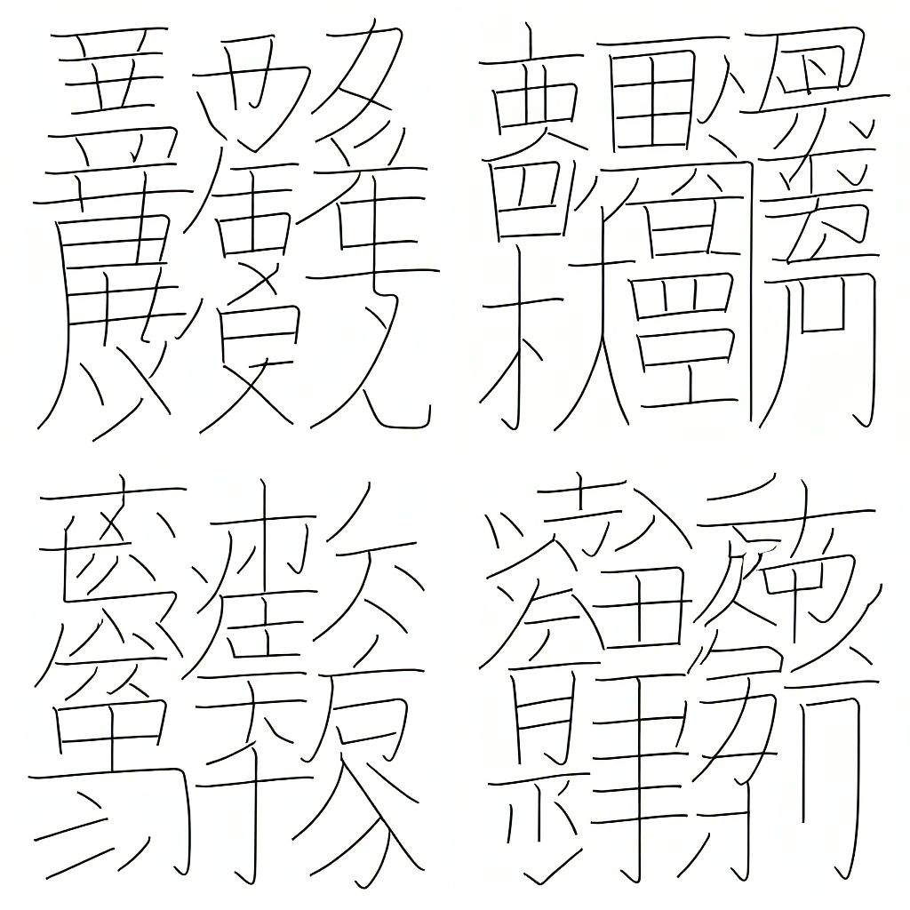
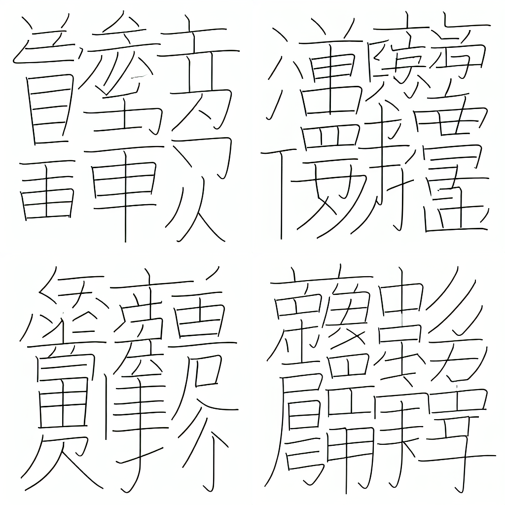
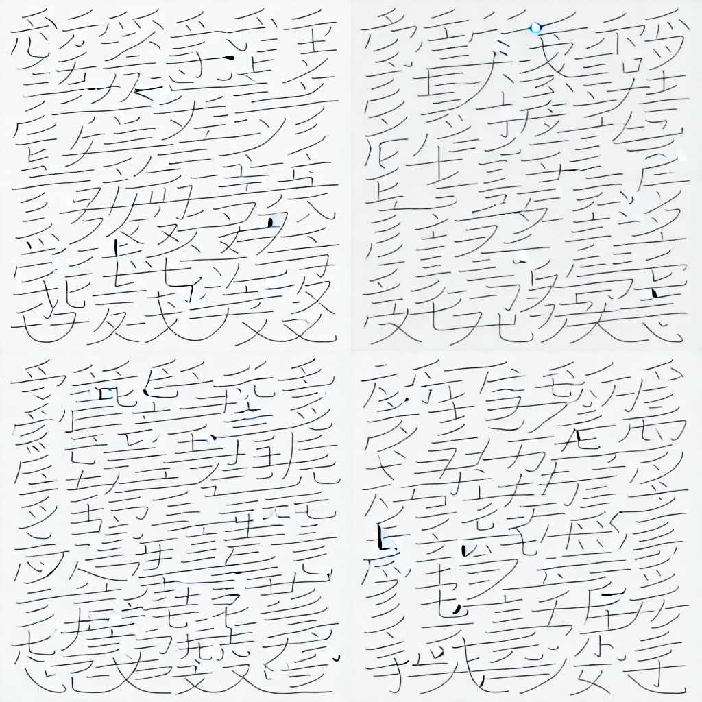
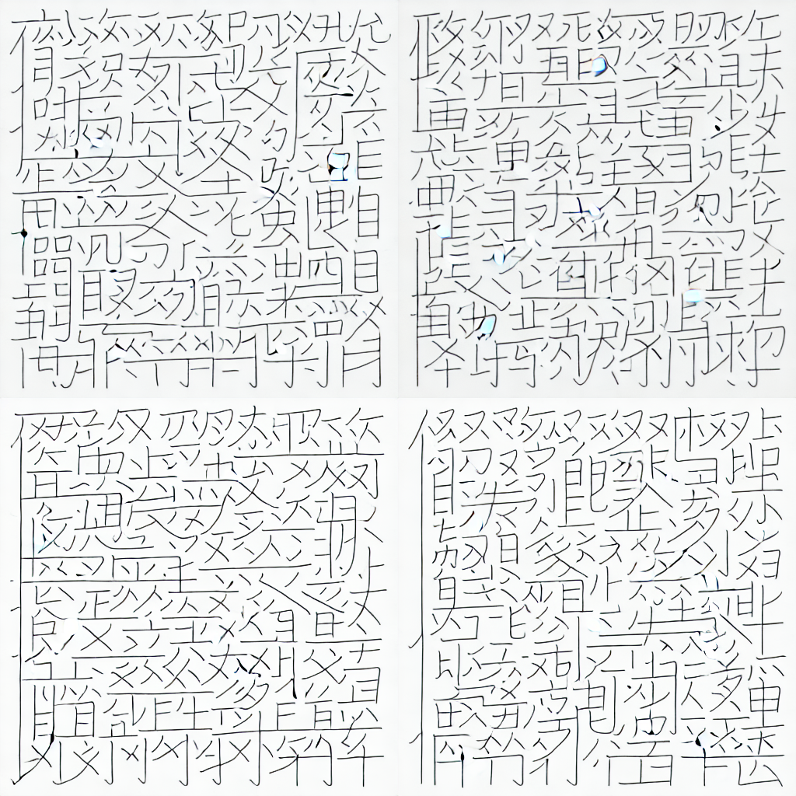
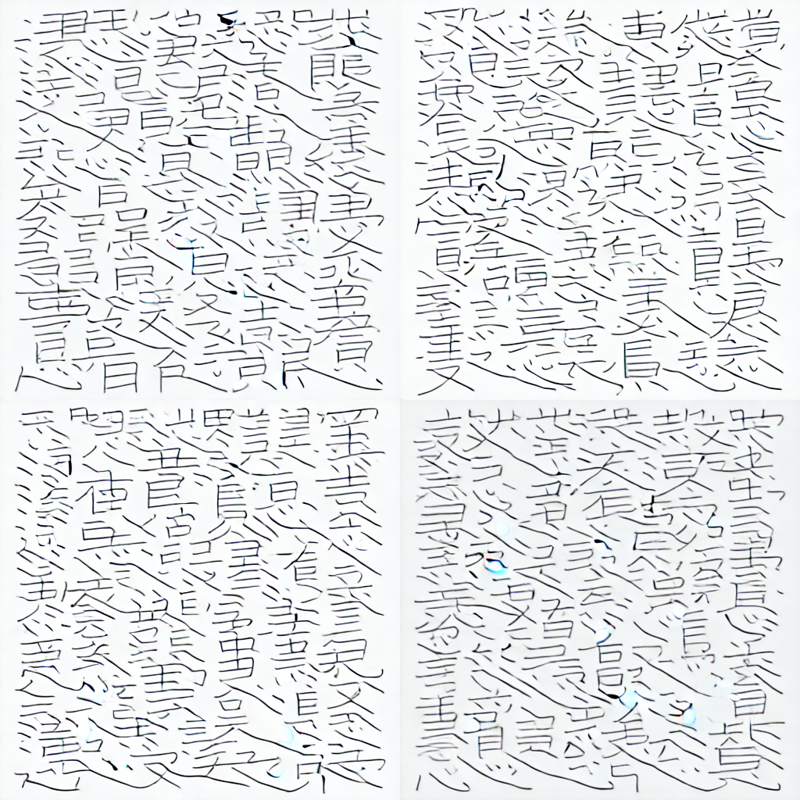
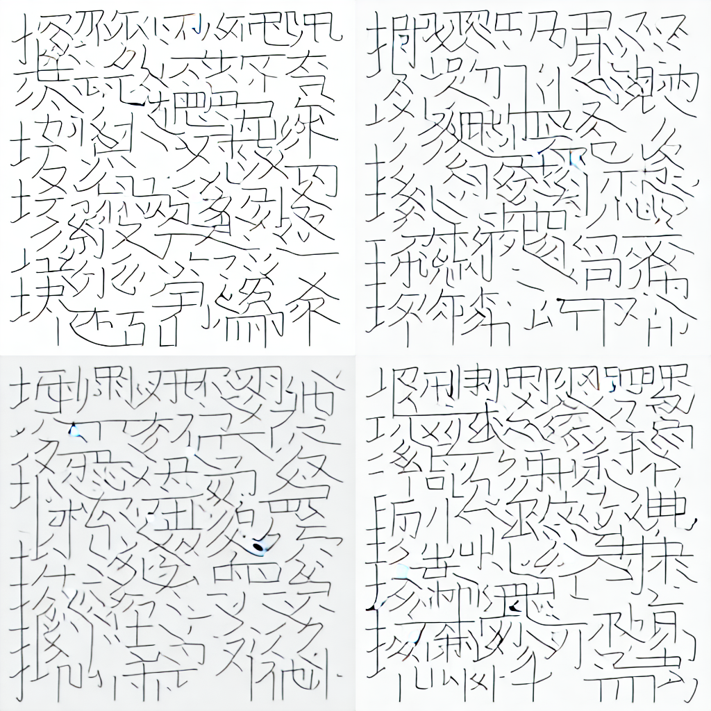

# Kanji Diffusion: Generating Kanji-like Glyphs from English Prompts


## Environment Setup

```bash
conda create -n kanji-diff python=3.10 -y
conda activate kanji-diff
conda install pip -y
pip install -r requirements.txt
```


## Inspiration & Credits
This project was inspired by these tweets:
- [](https://x.com/hardmaru/status/1611237067589095425)
- [](https://x.com/enpitsu/status/1610587513059684353)

Project by Nail Ibrahimli as a fun weekend project.

## Introduction
This fun project explores SD-based generative modeling for Japanese Kanji-like characters from English definitions. The goal is to enable a diffusion model to hallucinate plausible Kanji for concepts that do not have traditional characters (e.g., "Artificial Intelligence").

## Data Preprocessing Pipeline
- **Source:** KANJIDIC2 (Kanji + English meanings) and KanjiVG (SVG strokes)
- **Steps:**
  1. Parse KANJIDIC2 to extract Kanji and English meanings
  2. Extract and clean SVGs for each Kanji
  3. Render SVGs to black-on-white PNGs (128x128, 256x256)
  4. Pair each image with its English meanings
  5. Prepare data for training (DreamBooth, LoRA and vanilla text-to-image)

## Training Approaches

### DreamBooth LoRA (10K iters)
- **Prompt:** Uses a single prompt for all images (e.g., "a kanji character")
- **Strengths:** Simple, good for style transfer
- **Limitations:** Cannot map specific English meanings to glyphs; less flexible for novel concepts

### Text-to-Image LoRA (10K iters)
- **Prompt:** Uses per-image prompts
- **Strengths:** Learns to map specific English meanings to glyphs optimizing less parameters; strongly rely on prior  knowledge of network
- **Limitations:** Sligtly more complex task to learn, requires prompt-image mapping, and kanji images are not semantically meaningful

### Text-to-Image SD (20K iters)
- **Prompt:** Uses per-image prompts
- **Strengths:** Learns to map specific English meanings to glyphs optimizing; can overwrite prior knowledge
- **Limitations:** Complex task to learn, requires prompt-image mapping, and kanji images are not semantically meaningful

## Sample Results

Teaser images from the results (see `sample_results/` for more):

### DreamBooth LoRA
- Prompt: "a kanji character for love"
  - 
- Prompt: "a kanji character for Artificial Intelligence"
  - 

### Text-to-Image LoRA
- Prompt: "love; affection; favourite"
  - 
- Prompt: "Artificial Intelligence"
  - 

### Stable Diffusion: finetuning unet
- Prompt: "love; affection; favourite"
  - 
- Prompt: "Artificial Intelligence"
  - 

### Stable Diffusion: training unet from scratch
- Prompt: "love; affection; favourite"
  - 
- Prompt: "Artificial Intelligence"
  - 


*See the `sample_results/` folder for more generated examples.*

## Discussion
- **DreamBooth LoRA** is best for learning a style (Kanji-ness) but not for semantic mapping.
- **Text-to-Image LoRA** enables the model to generate plausible Kanji for arbitrary English prompts.

## Reproducibility
- All scripts and data processing steps are provided in `data_processing/`.
- Training and sample generation scripts are in `dreambooth_lora/` and `text_to_image_lora/`.
- Environment setup instructions are included.
- Results can be reproduced by following the README files in each folder.

---

## TODO (potential improvements)
- Implementing and train (VAE+UNet) a small Stable Diffusion model from scratch on the Kanji dataset and compare results.
- Disentangle Kanji words that have multiple meanings (e.g., "love" vs. "affection")
- Try other baselines (e.g. rectified flow models)

*For questions or contributions, contact the maintainer.* 